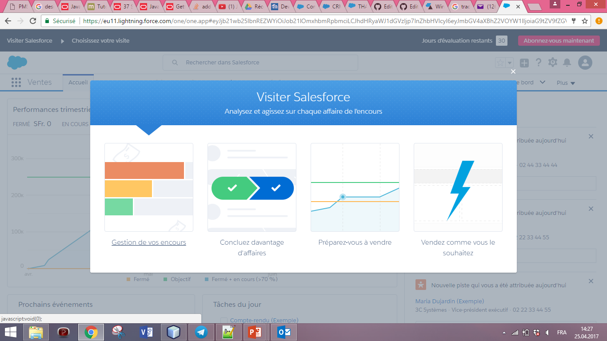

# LABORATOIRE 4 - Software as a sercice 

Dans ce laboratoire nous nous intéressons aux infrastructures cloud de type software as a service et plus particulièrement à salesforce. Nous allons premièrement crée un compte salesforce gratuit et nous familliariser avec l'application. Ensuite, nous allons évaluer les capacités d'importation de donnée depuis notre appli et préparer notre appli pour la vente (exportation de donnée). Enfin, évaluer les capacités de contrôle de mise à jour.

## ETUDIANTS 

* FRANCHINI Fabien
* DONGMO NGOUMNAI Annie Sandra

## TABLE DES MATIERES 

1. [Tâche 1: Inscription saleforce](#t%C3%82che-1-inscription-salesforce)
2. [Tâche 2: Familiarisation avec l'application](#t%C3%82che-2-familiarisation-avec-lapplication)
3. [Tâche 3: Evaluation de capacité d'importation des données](#t%C3%82che-3-evaluation-de-capacite-dimportation-des-donnees)
4. [Tâche 4: Preparation pour la vente](#t%C3%82che-4-preparation-pour-la-vente)
5. [Tâche 5: Evaluation des capacités de mise à jour de contrôle](#t%C3%82che-5-evaluation-des-capacites-de-controle-de-mise-a-jour)

## TÂCHE 1: INSCRIPTION SALESFORCE 

À partir du site officiel de salesforce nous avons choisit free trial pour créer notre compte 

nous sommes invité à entrer nos données 

après validation par email du compte crée, on se connecte pour la première fois à l'appli et une page d'acueil nous est affiché avec 4 différentes options de visites

## TÂCHE 2: FAMILIARISATION AVEC L'APPLICATION

Nous allons commençer notre visite par la gestion des encours 

en choisissant d'afficher toutes opportunitées on obtient un tableau d'opportunité avec 50 éléments et leur description (nom opportunité, montant, date cloture etc voire figure)

on constate qu'on peut également choisir de visualiser ses opportunitées sous forme de `kanban` (voire figure)

## TÂCHE 3: EVALUATION DE CAPACITE D'IMPORTATION DES DONNEES

ici nous allons tenter d'importer le fichier `contact.csv` contenant les données suivantes :
`Firstname, Lastname, Email, Preffered food
 Albert, einstein, aeinstein@hes-so.ch, French
 Bertrand, Piccard, bpiccard@hes-so.ch, Italian
 Claude, Nicollier, cnicollier@hes-so.ch, Mexican
`
pour cela dans la bar de menu nous choisissons l'option configuration une page d'acceuil s'affiche puis dans l'onglet donnée de la section Administration nous choisissons l'option Assistant d'importation de donnée (voire figure suivante):

on page suivante s'affiche nous proposant de lancer l'assistant d'importation

une fois lancer l'importation se passe en 3 étapes 

## TÂCHE 4: PREPARATION POUR LA VENTE
## TÂCHE 5: EVALUATION DES CAPACITES DE CONTRÔLE DE MISE A JOUR
